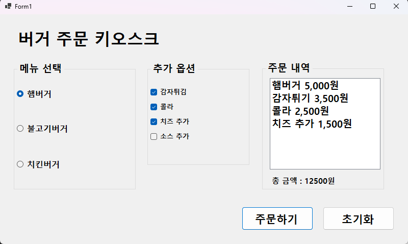
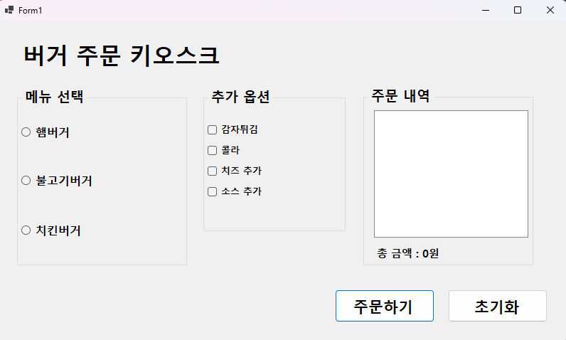
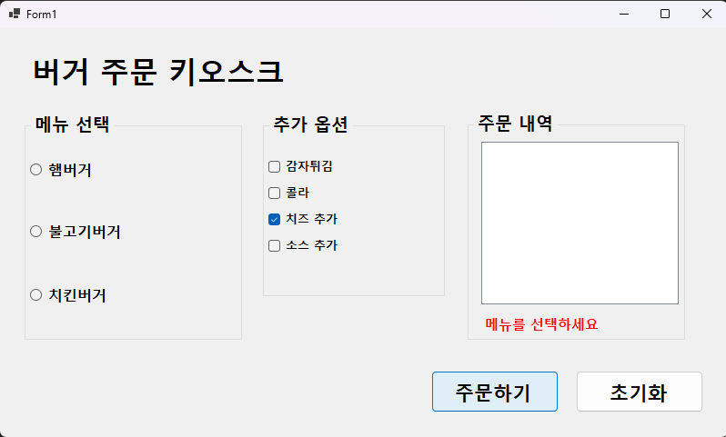
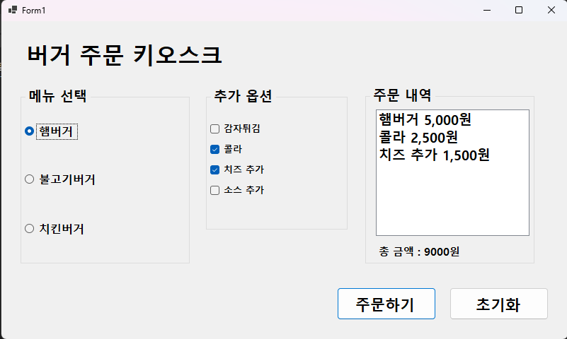
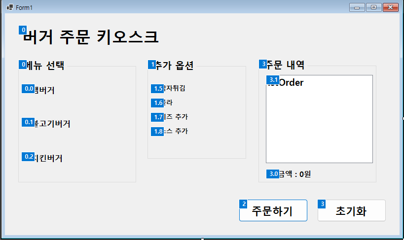
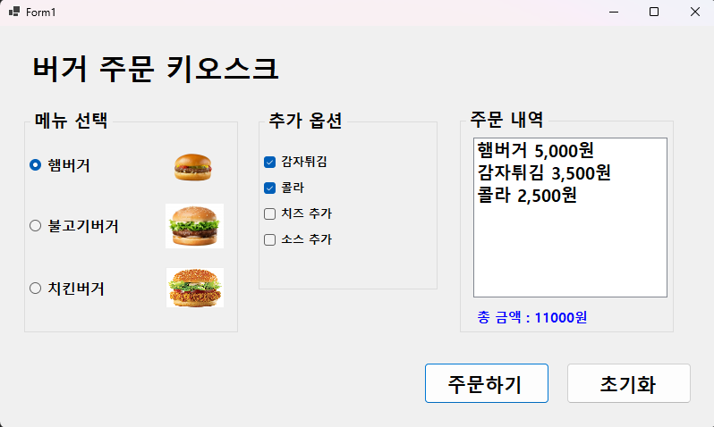
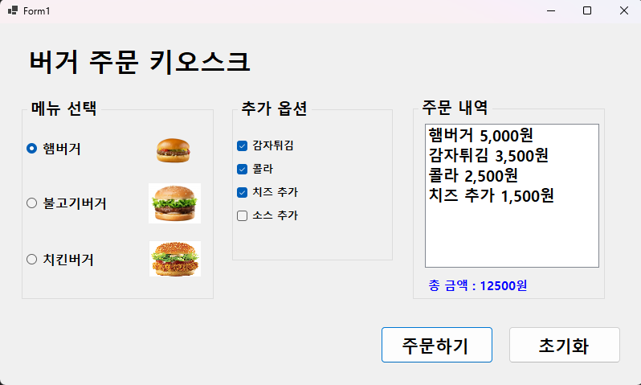

# (c#코딩) 버거 주문 키오스크 (BurgerKiosk)

##개요 
-c# 프로그래밍 학습
-설명 : 버튼에 입력한 정보를 텍스트 박스로 받아 계산 해주는 계산기 프로그램
-사용한 플랫폼 : net windows forms, visual studio, git hub 
-사용한 컨트롤 : label 2개, GroupBox 3개, RadioButton 3개, CheckBox 4개, ListBox 1개, Button 2개 배치 
-사용한 기술과 구현한 기능 : 
 -  컨트롤 배치와 기본적인 속성 제어 
 -  데이터 처리 및 연산 로직
 -  문자열 처리 및 동적 텍스트 결합
 -  사용자 편의 기능 (Tap키로 이동, 방향키로 메뉴 선택)

   ## 실행 화면 (과제 1)
   -과제 1 코드의 실행 스크린

   

   
   
   
   
  #과제내용
   
     - 컨트롤 배치와 기본적인 속성 설정
   
     - 선택된 항목 추출 기능 구현
   
     - 주문하기 버튼과 초기화 버튼의 기능 구현
   
   
   #구현 내용과 기능 설명
   
     - RadioButton과 CheckBox 등 을 적절히 배치
     
     - GroupBox로 적절하게 그룹으로 묶기
     
     - 주문내역 과 총금액을 표시.

     - 다시 주문 할 수 있도록 초기화

   ## 실행 화면 (과제 2)
   -과제 2 코드의 실행 스크린

   

   
   
   
   
  #과제내용
   
     - 아무것도 선택하지 않고 주문하기 버튼을 누르면 에러 메시지 표시
   
     - MessageBox 사용 보다는 Label 사용
   
   
   #구현 내용과 기능 설명
   
     - if문을 사용하여 선택 여부 확인
     
     - 기존 총 금액 Label에 "메뉴를 선택하세요" 오류 메세지 표시
     

   ## 실행 화면 (과제 3)
   -과제 3 코드의 실행 스크린

   

   
   
   
   
  #과제내용
   
     - 마우스 없이 키보드 입력만으로 주문이 가능하게 구현
   
     - Tab을 이용해서 GroupBox 사이를 이동
   
     - 방향키를 이용해서 선택 아이템 사이를 이동

     - 스페이스바를 이용해서 아이템 선택

     - Enter키로 버튼을 누르기
   
   
   #구현 내용과 기능 설명
   
     - Tab Order 설정 및 TabStop 속성 활용
     
     - WinForms 기본 접근성 프로토콜 활용
     
     - AcceptButton 및 포커스 제어 로직

   ## 실행 화면 (과제 4)
   -과제 4 코드의 실행 스크린

   

   
   
   
   
  #과제내용
   
     - RadioButton과 CheckBox에서 원하는 항목을 선택하면 그 즉시 정보들 업데이트
   
     - 선택하는 순간 ListBox에 주문내역이 표시 되도록 구현
   
     - 선택하는 순간 Label에 전체 가격 정보가 표시 되도록 구현
   
   
   #구현 내용과 기능 설명
   
     - CheckedChanged 이벤트 핸들러 통합
     
     - 중앙 집중형 데이터 갱신 로직
     
     - 동적 UI 동기화 및 데이터 바인딩

   #배운내용

    - 사용자의 클릭이나 선택 변경(CheckedChanged, Click)이 발생했을 때 프로그램이 어떻게 반응하는지 설계하고, 메서드와 이벤트를 연결하는 메커니즘을 습득

    - 마우스 없이도 키보드(Tab, Space, Enter)만으로 주문이 가능하도록 Tab Order와 AcceptButton 속성을 제어하는 실무적인 UI 설계 기법을 익힘

    - 메뉴 미선택 시 주문을 차단하고 라벨 색상 변경을 통해 직관적인 에러 메시지를 전달하는 예외 처리 방식을 구현 방법을 깨달음